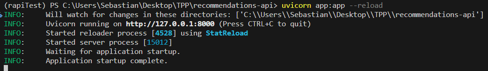

# recommendations-api

### Configuración de entorno (con Conda)
#### Instalación Conda
Se puede instalar el Gestor Anaconda, o directamente Conda
https://conda.io/projects/conda/en/latest/user-guide/install/index.html

Obs: Tambien debería guncionar con otros gestores de paquetes como venv, aunque no fue probado.

### Configuracion y ejecución
Crear un nuevo enviroment, activarlo e instalar dependencias
```
conda create -n rapi python=3.12
conda activate rapi
pip install -r requirements.txt
```

#### Ejecutar localmente
con el entorno rapi activado, ejecutar:
```
uvicorn app:app --reload 
```

#### Ejemplo de ejecución


#### Salir del entorno 'rapi'
```
conda deactivate
```

### Exportar nuevas dependencias
Si durante el desarrollo se agregaron nuevas dependencias al entorno, debe actualizarse el requirements.txt. La forma más rápida es con
```
pip freeze > requirements.txt
```